<div align="center">

<picture>
  <source media="(prefers-color-scheme: dark)" srcset="extension/app/brand/resupply-wordmark-dark.svg">
  
</picture>

**for Karoo. Offline POIs along your route, no signal needed.**

</div>

A [Hammerhead Karoo](https://www.hammerhead.io/) extension that turns a loaded route into an
offline roadbook of resupply stops along the way (food, water, coffee, bike shops, fuel), so
you can plan refuels without cellular signal. No route loaded? It finds resupply around you,
live.

<div align="center">
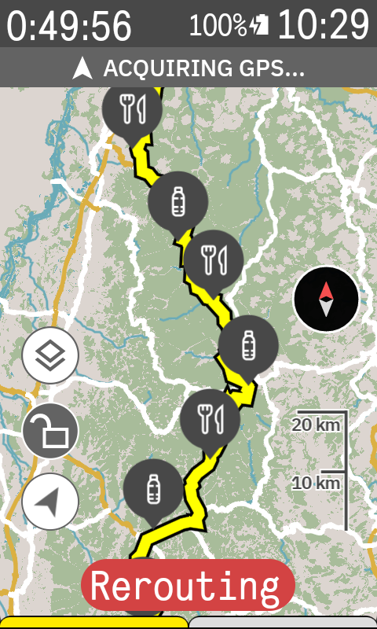
</div>

## Features

- **Offline resupply along a route.** Finds resupply stops along the route you're riding, no
  signal needed. The whole POI database rides along inside the app, so the build runs on-device
  and returns in a second or two.

  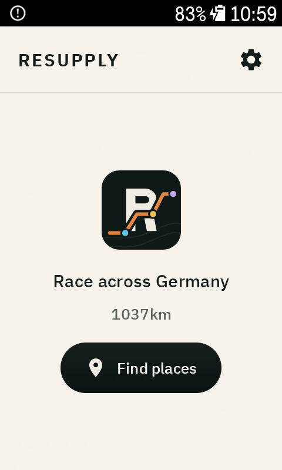

- **Favorites to plan ahead.** Star the stops you're aiming for to plan the ride, then refine
  your roadbook down to just those.

  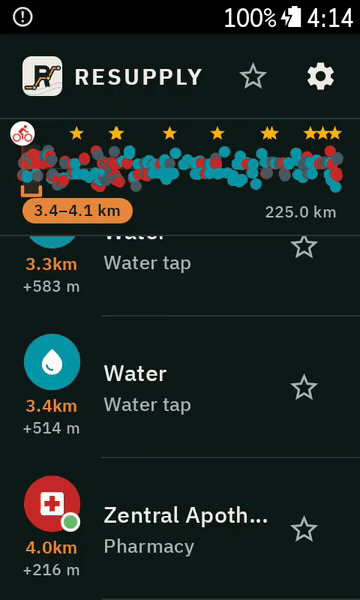

- **Live resupply around you.** No route loaded? Resupply finds places around you and keeps
  them fresh as you move.

  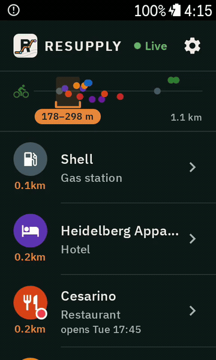

- **12 categories.** Restaurants, Supermarkets, Café & Bar, Water, Toilets, Bike shops, Fuel
  stations, Ice Cream, Hotels, Pharmacies, ATMs, and Campgrounds. Toggle any of them on or off
  on the fly; pins on the map always match your active filter.

  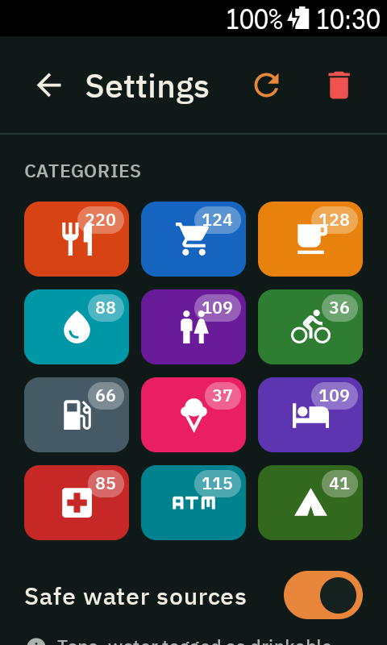

- **Safe water sources.** Shows drinkable water by default, hiding fountains and springs of
  unknown quality unless you want them.

  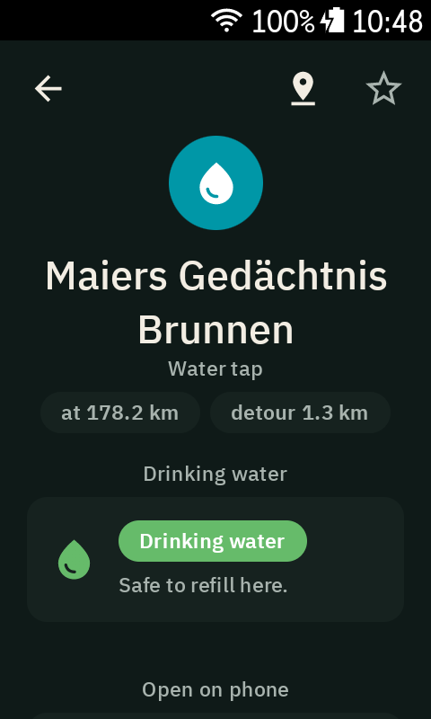

- **Downloadable regions.** Ships with a bundled seed and downloads more in-app: a single
  Bundesland, or whole countries across Europe and North America.

  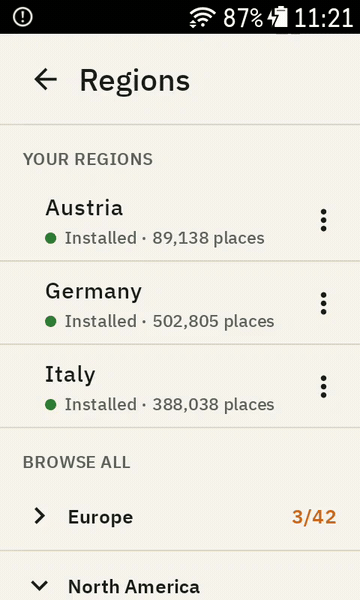

- **Data fields for the ride view.** Put upcoming resupply, your favorites, or any single
  category straight on your data pages: distance ahead, detour, and the next stops.

  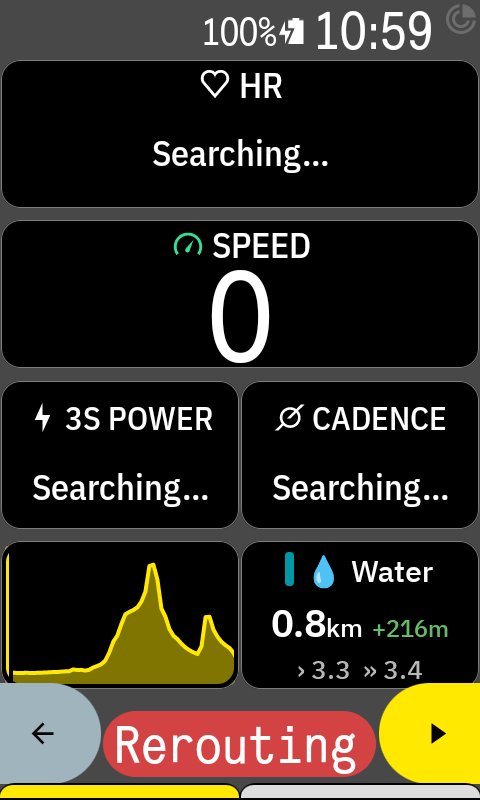

- **Place detail at a glance.** Opening hours, distance and detour, address and phone, a
  scannable Google Maps / website QR, and a short description for each stop.

  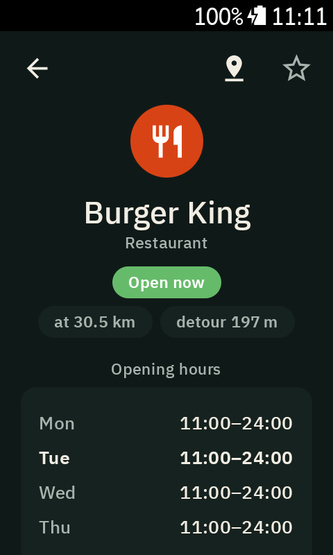
  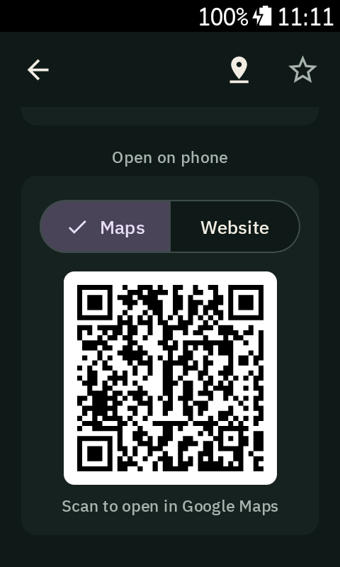

- **Google Maps for live data.** Fills in opening hours and contact details on demand when
  OpenStreetMap doesn't have them.

- **Smart search radius & themes.** Searches tight in busy areas and reaches further where
  places are sparse (or set a fixed radius yourself), plus light / dark / auto appearance.

  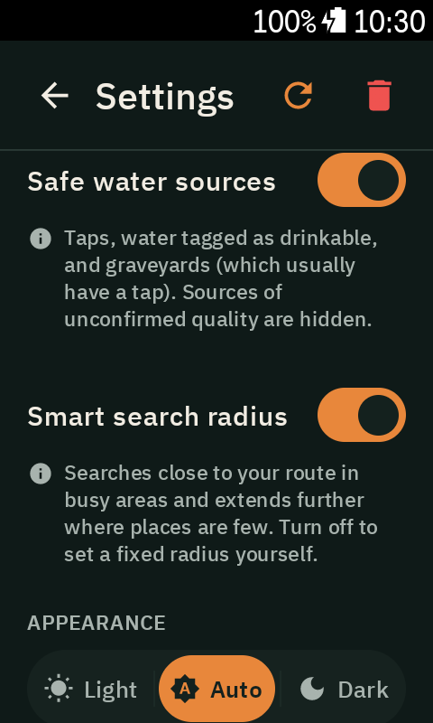
  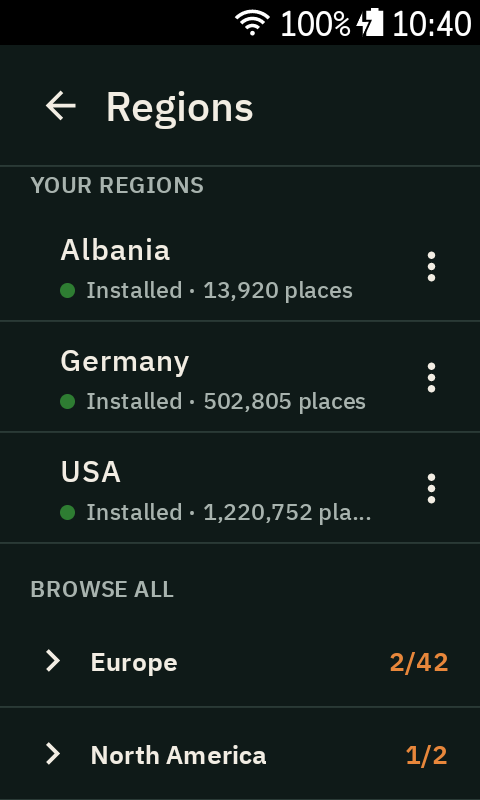

## How it works

The **`extension/`** directory is the whole app: an on-device Karoo app (Kotlin,
[karoo-ext](https://github.com/hammerheadnav/karoo-ext) SDK). It reads the loaded route, lets
you set a detour radius and category toggles, and queries the **spatial SQLite database
bundled with the app** (an R*Tree corridor search refined against the route line) to find
POIs. No server, fully offline. With no route loaded, the same search runs around your
current location instead. Results render as typed map pins and in the Waybook list, ordered by
distance along the route.

A rider can pick a detour distance from tight 100/250 m up to 5 km, and rebuild either from an
in-app Build button or an in-ride `BonusAction`. Density is capped adaptively so a city doesn't
flood the map while a quiet stretch still shows what's there. The only network calls are the
optional, on-demand Google Places and Wikipedia lookups; they route device to provider through
the Karoo HTTP bridge, so they work over a paired phone, not just WiFi.

POI data comes from [OpenStreetMap](https://www.openstreetmap.org/). The bundled database is
generated offline by **`extension/tools/poi-db/`** (downloads a regional extract, filters to
our POI tags, loads a spatial SQLite) and baked into the app as an asset the extension seeds
on first run. The bundled seed ships **all of Germany**; riders can download other regions
in-app (a single Bundesland, or other countries) from the region picker, which fetches a
compact per-region file and installs it on-device.

See [FOUNDATION.md](FOUNDATION.md) for the full architecture and design.

## Installing on a Karoo 3

Extensions are sideloaded. Grab the latest APK from [Releases](../../releases) and install it
via the Hammerhead Companion app (paste the release APK URL). For development, use USB:
`adb install` or `./gradlew :app:installDebug`.

## Building

### Extension

Requires JDK 17 and the Android SDK. karoo-ext is on GitHub Packages (auth required even
though it's public). Put credentials in `~/.gradle/gradle.properties`:

```properties
gpr.user=<your-github-username>
gpr.key=<a-PAT-with-read:packages>
```

```sh
cd extension
./gradlew :app:assembleDebug
```

The Google Places hours fallback needs a `PLACES_API_KEY` at build time; without it, that
feature is simply hidden.

### Refreshing the POI database

The bundled POI database is built offline (needs
[osmium-tool](https://osmcode.org/osmium-tool/)):

```sh
cd extension/tools/poi-db
npm install
# Rebuilds the bundled Germany seed → app/src/main/assets/pois-germany.sqlite
npm run build:seed
# Or build a single region for a quick test:
OSM_REGION=europe/germany/baden-wuerttemberg npm run build:poi-db
```

See [`extension/tools/poi-db/README.md`](extension/tools/poi-db/README.md) for options
(coverage, per-region files, forced re-download, bumping the DB version).

## Releases

The extension is versioned with [release-please](https://github.com/googleapis/release-please)
and Conventional Commits. `feat:`/`fix:` commits touching `extension/**` on `main` keep a
Release PR updated; merging it cuts the release: tag `extension-vX.Y.Z`, a GitHub Release,
and a CI-built APK attached as a release asset. Normal pushes don't publish an APK. See
[docs/releasing.md](docs/releasing.md).

## Data & attribution

POI data from OpenStreetMap contributors, © OpenStreetMap contributors, available under the
[Open Database License](https://www.openstreetmap.org/copyright).

Opening hours and contact details for a POI can be filled in on demand from **Google Maps**
(Places API) when OpenStreetMap has none. That content is shown live with a Google Maps
attribution and is not stored on the device. Only the resolved Place ID is cached, which
the Places policy permits.

## License

[Apache-2.0](LICENSE).
